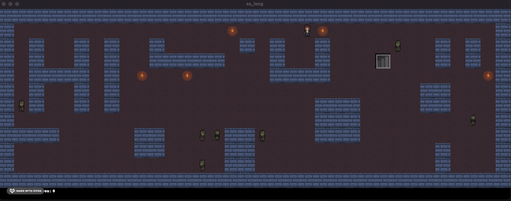

# About
So long is a simple 2D game implemented using the mlx library from 42 school. Your goal is to collect all the collectibles on the map (torches) without beeing caught by enemies. You'll be able able to exit the game through the exit door only if you collect all collectibles present on the map. Use the arrows to move, and press escape or close window if you want to exit the game prematurely.



# Usage
`git clone` and `cd` into the directory. Then hit `make` if you are a linux user or `make MODE=mac` a macOS user. The makefile will generate a `so_long` executable. If you want more features (enemies, move counter on screen) hit `make bonus MODE=your_OS`. Then run:
```shell
./so_long maps/<file_name>
```